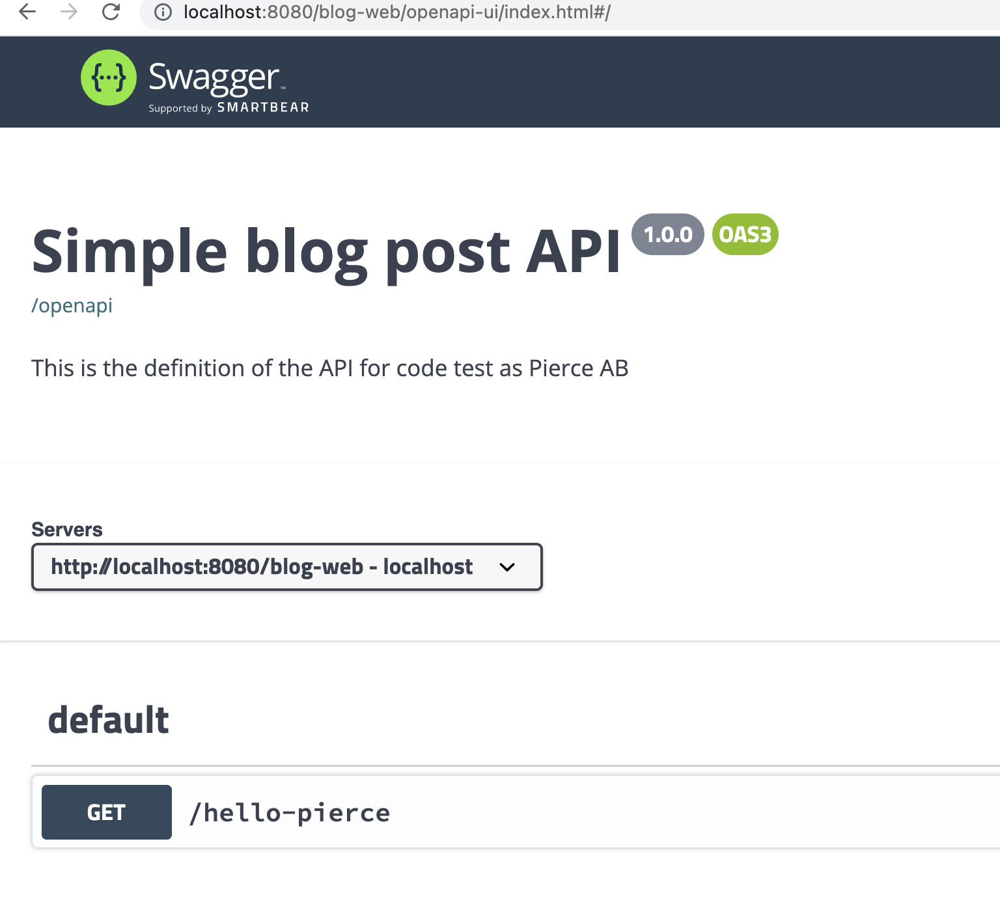

# Table of Contents
- [Table of Contents](#table-of-contents)
    - [1. Idea behind this readme](#1-idea-behind-this-readme)
    - [2. Hello World](#2-hello-world)
        - [2.1 Junit 4 -> Junit 5](#21-junit-4---junit-5)
    - [3. To use granular control or not?](#3-to-use-granular-control-or-not)
    - [4. Swagger & OpenAPI](#4-swagger--openapi)
    - [5. REST endpoints](#5-rest-endpoints)
    - [6. H2 database](#6-h2-database)
    - [7. JPA](#7-jpa)
    - [8. XML/Json support](#8-xmljson-support)
    - [9. Builders](#9-builders)
    - [10. Test](#10-test)
    - [X. Taking it further](#x-taking-it-further)
        - [Health checks](#health-checks)
        - [Custom Validations](#custom-validations)
        - [Request/Response logging](#requestresponse-logging)
## 1. Idea behind this readme

This project is a code test project and this readme is the path I took to solve it.
The assignment can be found here: [README.assignment.md](README.assignment.md)

## 2. Hello World
The first step was to get the test project up and running.
I downloaded [payara-micro-5.2021.10.jar](https://www.payara.fish/downloads/payara-platform-community-edition/)  

Encounter the first issue when attempting to compile 
```
mvn package
...
[ERROR] Failed to execute goal org.apache.maven.plugins:maven-war-plugin:2.3:war (default-war) on project blog-web: Execution default-war of goal org.apache.maven.plugins:maven-war-plugin:2.3:war failed: Unable to load the mojo 'war' in the plugin 'org.apache.maven.plugins:maven-war-plugin:2.3' due to an API incompatibility: org.codehaus.plexus.component.repository.exception.ComponentLookupException: null

```

API incompatibility, easily solved by bumping maven-war-plugin to 3.3.2

While at it, I decided to bump the rest of the dated libraries, bumped the Java version from 8 to 17 and the javaee platform to 8.0.1

I like to use https://mvnrepository.com to search for the latest version, but if you don't like the UI then https://repo1.maven.org/maven2/ is nice

After that the code ran.
```
java -jar ../payara-micro-5.2021.10.jar --deploy blog-web/target/blog-web.war
```

And going to http://localhost:8080/blog-web/hello-pierce I got
```json
{
"message": "Hello Pierce"
}
```


### 2.1 Junit 4 -> Junit 5
It is easy to get this upgrade wrong, that is why I made this subsection. 
The problem is that older version of maven-surefire-plugin does not support Junit 5.

You will not get an error if you run
``` 
mvn test
```
The test will just be ignored!

The minimum version required is 2.22.0 or higher
see https://github.com/junit-team/junit5-samples/blob/r5.3.1/junit5-jupiter-starter-maven/pom.xml

To check the version run
```a
mvn help:effective-pom  | grep surefire -B 1 -A 3
```
I got version 2.12.4, bumping the version to 3.0.0-M5 fixes the issue

```
<plugin>
   <artifactId>maven-surefire-plugin</artifactId>
   <version>3.0.0-M5</version>
</plugin>
```

## 3. To use granular control or not?
In JAXRSConfiguration getClasses() method is overwritten and implemented. 
I don't see the use of this and since resources can automatically be discovered
via classpath scanning, I removed it.

## 4. Swagger & OpenAPI
When it comes to RESTful services exposing them with Swagger is a standard.
Microprofile is based on Swagger, an interesting article on how to make use of it: 
https://www.phillip-kruger.com/post/microprofile_openapi_swaggerui

The projects OpenAPI specification can be found in http://localhost:8080/openapi

The project swagger can be found here: http://localhost:8080/blog-web/openapi-ui



## 5. REST endpoints

There are recurring questions that need to be answered when implementing REST endpoints. 
One of them is who own the id?

I do not agree with the assignment specification, if the id means nothing outside of 
the service then it shouldn't be supplied it is supposed to be generated by the service.
The post body shouldn't include an id.

Another thing I don't agree with is the 404 return for a PUT when the id does not exist. 
This behaviour is not supported in the specification: https://httpwg.org/specs/rfc7231.html#PUT

    If the target resource does not have a current representation and the PUT successfully creates one, 
    then the origin server MUST inform the user agent by sending a 201 (Created) response 
The implication of the above is that if the endpoint have the data to successfully create an entity it should. 

I also have an issue with 405 on POST. The specification states https://httpwg.org/specs/rfc7231.html#status.400
```
6.5.1. 400 Bad Request
The 400 (Bad Request) status code indicates that the server cannot or will not process the request due to something that is perceived to be a client error (e.g., malformed request syntax, invalid request message framing, or deceptive request routing).

```
while 405 is 
```
6.5.5. 405 Method Not Allowed
The 405 (Method Not Allowed) status code indicates that the method received in the request-line is known by the origin server but not supported by the target resource. The origin server MUST generate an Allow header field in a 405 response containing a list of the target resource's currently supported methods.
```

In conclusion, I accept the id as input, but in the absence of adhering to legacy I will return
400 for malformed input. PUT will not return 404 but will create the resource instead of 405.


## 6. H2 database
Data needs to live somewhere, and databases are a popular destination. I choose to use an H2 database.

## 7. JPA
I like SQL, but I don't like SQL in a JAVA program. I also don't like managing database connection, 
this is the reason I choose Hibernate and spring-data-jpa. 

## 8. XML/Json support
One of the requirements is the ability to accept & return data in different formats.
Two simple things where needed to achieve this one was to add produce consume annotations on the BlogPostResource
```java
@Produces({MediaType.APPLICATION_JSON, MediaType.APPLICATION_XML})
@Consumes({MediaType.APPLICATION_JSON, MediaType.APPLICATION_XML})
```
The other thing is XML annotation on the request class.

## 9. Builders
I make use of Builder pattern, a concrete example of this BlogPostBuilder which is generated from the BlogPost model.
The plugin I use to generate the builder class is https://plugins.jetbrains.com/plugin/6585-builder-generator

## 10. Test
One observation I made while I looked at the supplied 
[integration tests](https://github.com/24mx/codetest/blob/master/integration-test/src/test/java/com/pierceecom/blog/BlogTestIntegr.java):
they make use of methods that contain a try catch clause.
In general, I try to avoid swallowing errors when testing since the purpose of testing is to detect errors.

if you look at test_5_DeletePosts() it will actually return green even if there is no connection to the service.

I like simple tests that are not dependent on other tests. This makes it easier to investigate if a test fails.

I changed the name from BlogTestIntegr to BlogPostIntegrationTest to better follow Junit naming convention.

To run the integration test:
```
mvn package -Drun.integration.tests=true
```
## X. Taking it further
### Health checks
When deployed in production, endpoints for health checks need to exist.
Microprofile already has a simple implementation just add this to the pom

```xml
<dependency>
  <groupId>org.eclipse.microprofile.health</groupId>
  <artifactId>microprofile-health-api</artifactId>
  <version>4.0</version>
</dependency>
```
### Custom Validations
Custom Validations can be added by implementing javax.validation.ConstraintValidator

### Request/Response logging
During development and early stages of production there is a need to log the request and response as this would 
be helpful in investigating unpredicted behaviour. 
